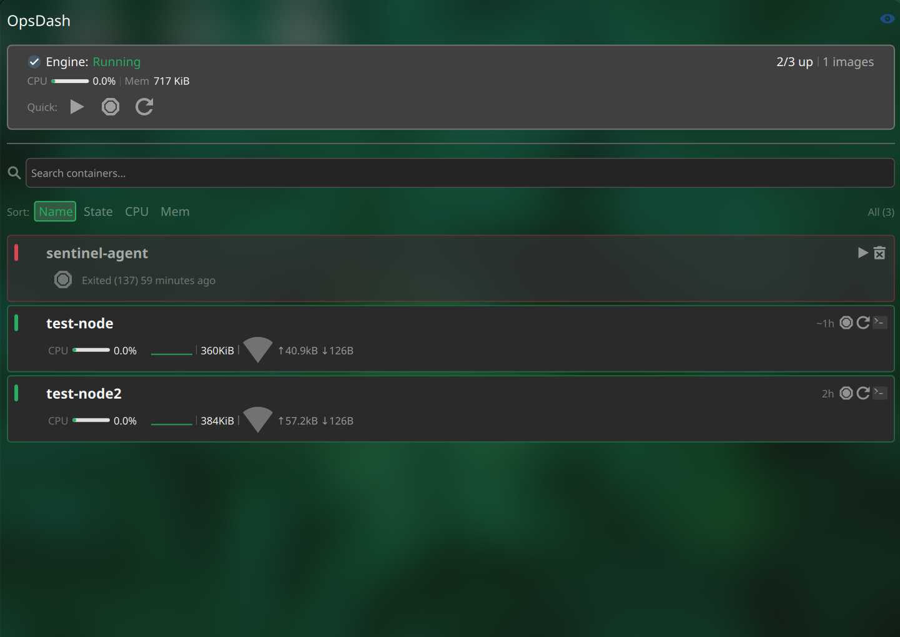

<p align="center">
  
  
  
  
  
</p>

<h1 align="center">OpsDash</h1>

<p align="center">
  <strong>A KDE Plasma 6 panel widget for real-time Docker container monitoring.</strong>
</p>

<p align="center">
  Live container count in the panel · Rich popup with CPU, memory, network and uptime stats<br>
  Per-container actions · Search and sort · Remote hosts · Wayland compatible
</p>

---

## Features

### Panel

- **Live container count** — shows `X/Y` (running/total) with the Docker icon
- **Status-aware colors** — green (all running), orange (partial), red (none running)
- **Warning badge** — appears when some containers are stopped
- **Rich tooltip** — hover to see aggregate stats: `3/5 up · CPU 12.4% · Mem 1.2 GiB`

### Popup

- **Two-tab layout** — switch between **Containers** and **Images**
- **Images tab** — list all Docker images with tags, IDs, and sizes; delete with a single click
- **Status card** — Docker engine status, aggregate CPU/memory bars, and image count
- **Global actions** — System Prune (remove unused data) and Restart All containers
- **Docker Compose grouping** — containers grouped by their Compose project
- **Compose batch actions** — start, stop, or restart every container in a project with one click
- **Container cards** with:
  - Status indicator, Docker icon, container name, and uptime
  - CPU usage bar with a sparkline history chart
  - Memory usage (used/total), network I/O, and port mappings
  - **Inline action buttons**: Start, Stop, Restart, Exec Shell (Konsole), Inline Logs, Remove
  - **Expandable logs** — the last 20 lines of container logs, shown inside the widget and auto-refreshed
- **State differentiation** — running (green), stopped (red), paused (orange), restarting (yellow)
- **Search and sort** — filter containers by name in real time; sort by Name, State, CPU, or Memory

### Configuration

The settings dialog is organized into three tabs:

- **General**
  - **Docker Host** — point at a remote host via `ssh://user@ip`, or leave empty for localhost
  - **Refresh interval** — 1–60 seconds
- **Behavior**
  - Desktop notifications for state changes (start/stop/remove)
  - **Resource usage alerts** — desktop notifications when a container exceeds your CPU or memory thresholds
  - Show all containers or running containers only
- **Appearance**
  - Panel icon size, font size, and custom color overrides
  - Popup dimensions (width/height), font colors, and card border thickness

---

## Preview

<p align="center">
  
</p>

<details>
<summary>ASCII layout diagram</summary>

```text
+-- Panel --------------------------------------------------+
|  [docker]  3/5  [warning]                                |
+----------------------------------------------------------+

+-- Popup --------------------------------------------------+
|  OpsDash Control Center                                   |
|  [ Containers ] [ Images ]                                |
|                                                           |
|  +-- Status --------------------------------------------+ |
|  | Engine: Running   3/5 up   |   12 images             | |
|  | CPU [####......] 12.4%                                | |
|  | Mem [######....] 1.2 GiB                              | |
|  | [System Prune]  [Restart All]                         | |
|  +-------------------------------------------------------+ |
|                                                           |
|  my-compose-project                  [Start][Stop][Restart]|
|  +-- nginx-proxy --------------------------------------+  |
|  | docker  nginx-proxy   Up 3d 2h                      |  |
|  |    [Start][Stop][Restart][Logs][Exec][Remove]       |  |
|  | CPU [###.......] 4.2%   /\/\   Mem: 128 MiB         |  |
|  | Net: ^12 MB  v45 MB    Ports: 80, 443               |  |
|  | --------------------------------------------------- |  |
|  | > 2026-05-30 nginx start worker                     |  |
|  +-------------------------------------------------------+ |
+-----------------------------------------------------------+
```

</details>

## Requirements

| Requirement | Version |
|---|---|
| KDE Plasma | **6.0+** (tested on 6.6.5) |
| Qt | **6.x** |
| Docker | Any version with the `docker ps` / `docker stats` CLI |
| Konsole | Required for the Exec Shell feature |
| `notify-send` | Required for desktop notifications (optional) |
| Linux | Any distribution running Plasma 6 |

Tested on:

- **EndeavourOS (Arch Linux)** — Plasma 6.6.5, Wayland
- Expected to work on KDE Neon, Fedora Kinoite, openSUSE Tumbleweed, NixOS, and similar

## Installation

### Manual install

```bash
# Clone the repository
git clone https://github.com/harunkrl/opsdash-plasmoid.git

# Copy to Plasma's local plasmoid directory
cp -r opsdash-plasmoid ~/.local/share/plasma/plasmoids/com.ops.dash

# Rebuild Plasma's service cache
kbuildsycoca6

# Restart the Plasma shell
systemctl --user restart plasma-plasmashell.service
```

### Add to the panel

1. Right-click your Plasma panel
2. Select **Add Widgets…**
3. Search for **OpsDash**
4. Drag it onto your panel

## Configuration

Right-click the widget and choose **Configure OpsDash…**.

Settings are split across three tabs: **General**, **Behavior**, and **Appearance** (described above). The dialog supports scrolling.

## How it works

### Architecture

The widget polls the Docker CLI on a configurable timer and parses the results into its UI:

```text
Timer (configurable interval)
  |
  +-> docker -H <host> ps -a --format '{{.Names}}|{{.State}}|{{.Status}}|{{.Ports}}|{{.Labels}}'
  |     +-> Container list with Compose projects, states, and uptime
  |
  +-> docker -H <host> stats --no-stream --format '{{.Name}}|{{.CPUPerc}}|{{.MemUsage}}|...'
  |     +-> Resource usage, and threshold evaluation for alerts
  |
  +-> echo "$(docker -H <host> images -q | wc -l)|..."
  |     +-> System overview
  |
  +-> docker -H <host> images --format '{{.ID}}|{{.Repository}}|{{.Tag}}|{{.Size}}'
        +-> Populates the Images tab
```

### Technical stack

| Component | Technology |
|---|---|
| Root element | `PlasmoidItem` (Plasma 6 applet) |
| Command execution | `Plasma5Support.DataSource` (engine: `"executable"`) |
| UI framework | `Kirigami`, `PlasmaComponents3`, and `QQC2.ScrollView` |
| Configuration | Multi-tab UI via `config.qml` and `main.xml` |

## Troubleshooting

### The widget shows "Unsupported widget"

OpsDash requires Plasma **6.0+**. It does not run on Plasma 5.

### The container count stays at 0

Make sure your user can run Docker without sudo:

```bash
docker ps -q | wc -l
```

If that fails, add your user to the `docker` group:

```bash
sudo usermod -aG docker $USER
```

### Changes are not reflected after editing files

Restart Plasma after modifying widget files:

```bash
systemctl --user restart plasma-plasmashell.service
```

## Roadmap

- [x] Docker Compose project grouping
- [x] Inline log preview inside the popup
- [x] Multiple Docker host support (remote SSH)
- [ ] Custom color themes and presets
- [ ] Health check status (healthy/unhealthy)

## Contributing

Contributions are welcome. Fork the repository, create a branch, commit your changes, and open a pull request.

## License

This project is licensed under the **GNU General Public License v3.0**. See the [LICENSE](LICENSE) file for details.
